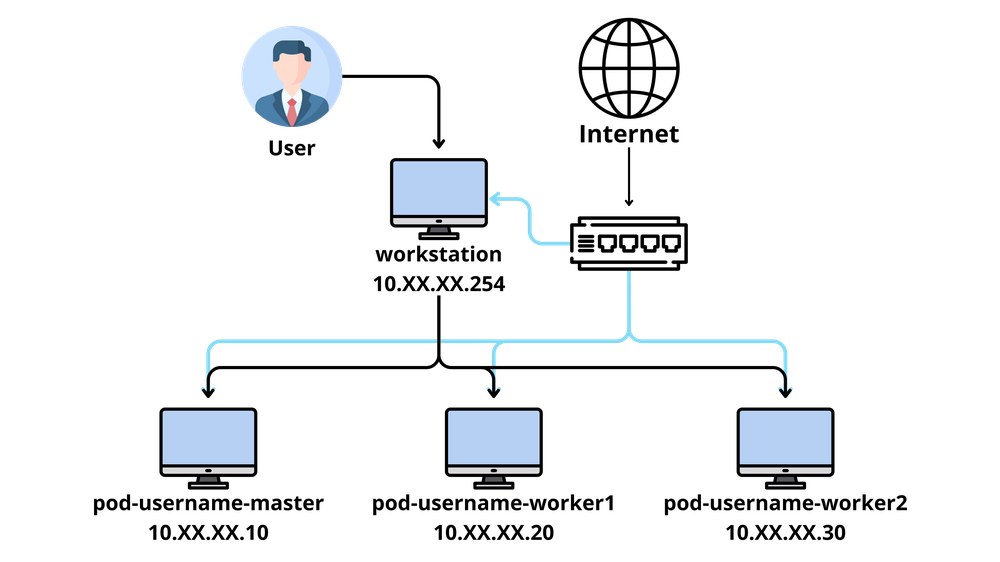

# Kubernetes Installation Guide w/ kubeadm

- **Date:** July 9th, 2026

## Table of Contents

<!--toc:start-->

- [Table of Contents](#table-of-contents)
- [Overview](#overview)
  - [A. Vanilla Upstream](#a-vanilla-upstream)
  - [B. Kubernetes Distributions (Distro)](#b-kubernetes-distributions-distro)
  - [C. Local Dev Only](#c-local-dev-only)
- [Topology](#topology)
- [Installation Guide](#installation-guide)
  - [0. Pre-Requisites](#0-pre-requisites)
  - [1. Install `containerd` untuk container runtime](#1-install-containerd-untuk-container-runtime)
  - [2. Konfigurasi Kernel](#2-konfigurasi-kernel)
  - [3. Install `kubelet`, `kubeadm`, dan `kubectl`](#3-install-kubelet-kubeadm-dan-kubectl)
  - [4. Init Master Node](#4-init-master-node)
  - [5. Worker Join Node](#5-worker-join-node)
  - [6. Verify Nodes & Pods](#6-verify-nodes-pods)
  <!--toc:end-->

---

## Overview

[Sama seperti OpenStack](../openstack/1-setup-intallation.md), yaitu banyak metode
untuk menginstall / setup kube / k8s / Kubernetes. Bedanya yaitu Kubernetes
menyediakan versi 'vanilla upstream', yaitu install dari [sumber aslinya](https://github.com/kubernetes/kubernetes).
Tetapi beberapa organisasi/community melakukan dan menawarkan Kubernetes yang di
kostumisasi (disebut Distro Kubernetes). Sehingga instalasinya memiliki banyak metode/
cara. Diantaranya:

### A. Vanilla Upstream

Saat menggunakan Kubernetes versi vanilla upstream, dapat dilakukan dengan 3 cara:

1. Install & setup manual

   Tahapan ini mekukan download binary Kubernetes (dan komponennya), install & setup
   container runtime (seperti `containerd`), kemudian setup certificates/SSL, hingga
   melakukan join node semuanya secara manual.

2. Menggunakan Bootstrap / Installer Tools

   Install & setup manual membutuhkan banyak waktu dan effort. Selain itu banyak
   juga overhead. Terkadang install & setup manual juga belum tentu _production ready:tm:_.
   Maka dari itu, terdapat bootstrap / installer tools.

   Bootstrap / installer tools ini berguna untuk melakukan otomatis setup / instalasi
   Kubernetes. Beberapa tools juga menyediakan setup yang siap untuk production.
   Fungsi nya yaitu untuk memudahkan instalasi Kubernetes dan mengurangi overhead
   saat setup. Tidak hanya itu, biasanya bootstrap / installer tools juga menawarkan
   fitur untuk update kubernetes.

   Beberapa contoh bootstrap / installer tools:
   - [Kubeadm](https://kubernetes.io/docs/reference/setup-tools/kubeadm/) -
     official, low level
   - [Kubespray](https://github.com/kubernetes-sigs/kubespray) - ansible version
     of kubeadm, bare metal
   - [kOps](https://kops.sigs.k8s.io/) - AWS-native / GKE / public cloud provisioning
   - [Cluster API (CAPI)](https://cluster-api.sigs.k8s.io/) - kube-native, multi-cloud

3. Install dari sources (_build from sources like a nerd:tm:_)

   Tahapan ini sangat jarang dilakukan. But worth to know. Dilakukan ketika ingin
   melakukan kontribusi / develop kubernetes engine itu sendiri. Tahapannya itu
   dengan melakukan compile source code Kubernetes, kemudian melakukan install &
   setup manual. Lihat detail step [disini](https://github.com/kubernetes/kubernetes/blob/master/build/README.md).

### B. Kubernetes Distributions (Distro)

Beberapa organisasi/perusahan/komunitas melakukan kostumisasi pada Kubernetes dengan
tujuan tertentu (misalnya meningkatkan performa, atau menyederhanakan komponen-komponennya).
Kemudian mereka mendistribusikannya, dan kita dapat menggunakannya. Hal inilah yang
disebut Kubernetes Distributions / Kubernetes Distro.

Setiap distro memiliki memiliki cara / metode instalasinya tersendiri. Ada yang
sudah include dengan bootstrap tools, ada yang menyediakan installer script yang
di download melalui `curl` atau `wget`, dsb. _Just [RTFM](https://en.wikipedia.org/wiki/RTFM)
in their official site_.

Beberapa contoh Kubernetes Distro:

- [k3s](https://k3s.io/)

  Lightweight Kubernetes, single binary. Cocok untuk IoT & Edge computing.
  Setup via installer script (`curl | sh`)

- [k0s](https://k0sproject.io/)

  Zero Friction, Zero Deps Kubernetes, single binary. Setup memiliki bootstrap
  tools sendiri bernama `k0sctl`.

- [Rancher / RKE2](https://docs.rke2.io/)

  Enterprise, security standard & hardened Kubernetes distro. Setup via
  installer script & agent service.

- [OpenShift](https://okd.io/)

  Enterprise Kubernetes distro. Setup memiliki bootstrap tools sendiri bernama
  `openshift-install`.

- Talos Linux

  no-os, immutable, API only Kubernetes Distro. Disebut `no-os` karena Talos Linux
  sebenarnya adalah distro Linux yang sudah menyediakan kubernetes. Setup memiliki
  installer/CLI tools sendiri bernama `talosctl`.

### C. Local Dev Only

Terdapat juga Kubernetes yang digunakan untuk sandbox/belajar, testing, atau develop
dengan Kubernetes. Umumnya berjalan di single node, dan beberapa diantaranya sebenarnya
bukan cluster, tetapi hanya simulasi cluster. Kubernetes ini tidak prod-ready.

> [!NOTE]
> Sama seperti kubernetes distro, kubernetes untuk local dev juga memiliki cara /
> metode untuk install & setup nya masing-masing.

Beberapa contoh Kubernetes untuk local dev:

- [MiniKube](https://minikube.sigs.k8s.io/docs/) - local dev, multi-driver
- [Kind (Kubenertes-in-Docker)](https://kind.sigs.k8s.io/) - local dev, mensimulasikan
  node sebagai container
- [k3d](https://k3d.io/stable/) - local dev, k3s wrapper in docker
- [Docker Desktop](https://www.docker.com/blog/how-to-set-up-a-kubernetes-cluster-on-docker-desktop/)
  Docker Desktop versi terbaru menawarkan fitur Kubenertes untuk local dev

---

## Topology

Lab ini menggunakan 3 nodes untuk praktikum kubernetes. Nodes ini adalah VM yang
berjalan diatas OpenStack Nova Instance. Berikut topologi jaringannya:



Seluruh VM di-install dengan Ubuntu Server 24.04 LTS. Detail Specs VM:

| VM          | CPU    | RAM | Disk | IP           | Hostname             |
| ----------- | ------ | --- | ---- | ------------ | -------------------- |
| pod-master  | 2 vCPU | 2GB | 20GB | 10.1.1.10/24 | pod-username-master  |
| pod-worker1 | 2 vCPU | 2GB | 20GB | 10.1.1.20/24 | pod-username-worker1 |
| pod-worker2 | 2 vCPU | 2GB | 20GB | 10.1.1.30/24 | pod-username-worker2 |

---

## Installation Guide

> [!NOTE]
> Kubernetes yang akan di install pada lab ini yaitu `v1.32.13`.

### 0. Pre-Requisites

> [!IMPORTANT]
> Jalankan tahapan ini di **semua node**.

1. Update Deps

   ```sh
   sudo apt update
   sudo apt upgrade -y
   sudo apt autoremove -y
   ```

2. Install Deps yang diperlukan

   ```sh
   sudo apt install -y \
    curl vim git \
    gnupg2 software-properties-common apt-transport-https ca-certificates
   ```

### 1. Install `containerd` untuk container runtime

> [!IMPORTANT]
> Jalankan tahapan ini di **semua node**.

1. Enable Docker Repository

   > [!NOTE]
   > Docker repository digunakan untuk mendownload & install `containerd`

   ```sh
   sudo curl -fsSL https://download.docker.com/linux/ubuntu/gpg | sudo gpg --dearmour -o /etc/apt/trusted.gpg.d/docker.gpg

   sudo add-apt-repository "deb [arch=amd64] https://download.docker.com/linux/ubuntu $(lsb_release -cs) stable"
   ```

2. Install `containerd`

   ```sh
   sudo apt update
   sudo apt install -y containerd.io
   ```

3. Konfigurasi `containerd`

   > [!NOTE]
   > Digunakan agar `containerd` bisa berjalan menggunakan `systemd` sebagai `cgroup`

   ```sh
   sudo containerd config default | sudo tee /etc/containerd/config.toml >/dev/null 2>&1
   sudo sed -i 's/SystemdCgroup \= false/SystemdCgroup \= true/g' /etc/containerd/config.toml
   ```

4. Enable `containerd` service

   ```sh
   sudo systemctl enable --now containerd
   ```

### 2. Konfigurasi Kernel

> [!IMPORTANT]
> Jalankan tahapan ini di **semua node**.

1. Tambah kernel settings

   > [!NOTE]
   >
   > - module `overlay` digunakan untuk filesystem driver containers
   > - module `br_netfilter` digunakan untuk bridge traffic agar Pod bisa saling
   >   berkomunikasi

   ```sh
   cat <<EOF | sudo tee /etc/modules-load.d/k8s.conf
   overlay
   br_netfilter
   EOF
   ```

2. Enable kernel modules

   ```sh
   sudo modprobe overlay
   sudo modprobe br_netfilter
   ```

3. Atur `sysctl` parameters (params)

   > [!NOTE]
   > Digunakan untuk forward packet antara pod dengan outside network/host network

   ```sh
   cat <<EOF | sudo tee /etc/sysctl.d/k8s.conf
   net.bridge.bridge-nf-call-iptables  = 1
   net.bridge.bridge-nf-call-ip6tables = 1
   net.ipv4.ip_forward = 1
   EOF
   ```

4. Terapkan `sysctl` params tanpa reboot

   ```sh
   sudo sysctl --system
   ```

### 3. Install `kubelet`, `kubeadm`, dan `kubectl`

> [!IMPORTANT]
> Jalankan tahapan ini di **semua node**.

1. Download Google Cloud public signing key

   ```sh
   curl -fsSL https://pkgs.k8s.io/core:/stable:/v1.32/deb/Release.key \
    | sudo gpg --dearmor -o /etc/apt/keyrings/kubernetes-apt-keyring.gpg

   sudo chmod 644 /etc/apt/keyrings/kubernetes-apt-keyring.gpg
   ```

2. Add kubernetes apt repository

   ```sh
   echo 'deb [signed-by=/etc/apt/keyrings/kubernetes-apt-keyring.gpg] https://pkgs.k8s.io/core:/stable:/v1.32/deb/ /' \
    | sudo tee /etc/apt/sources.list.d/kubernetes.list

   sudo chmod 644 /etc/apt/sources.list.d/kubernetes.list
   ```

3. Update & Install Deps

   ```sh
   sudo apt update
   sudo apt intall -y kubelet kubeadm kubectl
   ```

### 4. Init Master Node

> [!IMPORTANT]
> Jalankan tahapan ini **hanya di master node**.

1. Disable swap files

   > [!NOTE]
   > Kubenertes membutuhkan disable swap karena swap menyimpan data dari RAM
   > ke storage yang membuat lambat. Kubenertes scheduler tidak bisa mengenali
   > data yang disimpan di RAM ataupun di swap. Sehingga jika diaktifkan, maka
   > pod bisa berjalan lebih lambat dan mengakibatkan resource starving.
   >
   > Pada Kubernetes versi terbaru (>= v1.28), hal ini bisa diatasi

   ```sh
   swapon -s
   sudo swapoff -a
   ```

2. Init

   > [!NOTE]
   > CIDR `10.244.xx.0/16`, prefix (`10.244`) digunakan agar sesuai dengan default
   > CIDR CNI plugin yang akan di-install yaitu [Flannel](https://github.com/flannel-io/flannel).
   > Sehingga tidak ada configuration mismatch

   ```sh
   # Template
   # sudo kubeadm init --pod-network-cidr=10.244.XX.0/16

   sudo kubeadm init --pod-network-cidr=10.244.1.0/16
   ```

3. Copy Admin Configuration

   Buat direktori, copy, kemudian ubah owner dari file konfigurasi

   ```sh
   mkdir -p $HOME/.kube

   sudo cp -i /etc/kubernetes/admin.conf $HOME/.kube/config

   sudo chown $(id -u):$(id -g) $HOME/.kube/config
   ```

4. Install POD Network [Flannel](https://github.com/flannel-io/flannel)

   Download konfigurasi

   ```sh
   wget https://raw.githubusercontent.com/coreos/flannel/master/Documentation/kube-flannel.yml
   ```

   Apply konfigurasi Flannel ke Kubernetes

   ```sh
   kubectl apply -f kube-flannel.yml
   ```

   Lihat status pods

   ```sh
   kubectl get pods --all-namespaces --watch
   ```

   > [!TIP]
   > Tunggu dan pastikan semua pods (terutama pods flannel) memiliki status `Running`

5. Verifikasi Konfigurasi dan Cluster

   > [!NOTE]
   > Jika berhasil akan menampilkan informasi seperti user, cluster, and endpoint
   > dari control plane serta CoreDNS

   ```sh
   # verify config
   kubectl config view

   # verify cluster
   kubectl cluster-info
   ```

6. Tampilkan Token dan CA Certificates Hash

   > [!NOTE]
   > Simpan ini. Akan digunakan untuk worker node agar bisa terhubung ke master node

   Lihat token. Sifat nya sementara (umumnya 24 jam). Digunakan untuk authentication.
   Seperti temporary password

   ```sh
   sudo kubeadm token list
   ```

   Lihat Token CA Certificates Hash. Digunakan untuk verify master node identity.
   Menghindari MitM. Seperti SSH host key verification

   ```sh
   sudo openssl x509 -pubkey -in /etc/kubernetes/pki/ca.crt \
    | openssl rsa -pubin -outform der 2>/dev/null \
    | openssl dgst -sha256 -hex | sed 's/^.* //'
   ```

### 5. Worker Join Node

> [!IMPORTANT]
> Jalankan tahapan ini hanya di semua **worker nodes**.

1. Disable swap files

   > [!NOTE]
   > Kubenertes membutuhkan disable swap karena swap menyimpan data dari RAM
   > ke storage yang membuat lambat. Kubenertes scheduler tidak bisa mengenali
   > data yang disimpan di RAM ataupun di swap. Sehingga jika diaktifkan, maka
   > pod bisa berjalan lebih lambat dan mengakibatkan resource starving.
   >
   > Pada Kubernetes versi terbaru (>= v1.28), hal ini bisa diatasi

   ```sh
   swapon -s
   sudo swapoff -a
   ```

2. Join ke Master Node

   > [!TIP]
   > Tahap ini bergantung pada [tahap sebelumnya](#4-init-master-node) pada
   > step 6. Ganti/sesuaikan:
   >
   > - `[TOKEN]` dengan token dari master node
   > - `[NODE-MASTER]` dengan IP / hostname master node
   > - `[TOKEN-CA-CERT-HASH]` dengan CA certificates Hash yang dibuat di master node

   ```sh
   sudo kubeadm join --token [TOKEN] \
     [NODE-MASTER]:6443 \
     --discovery-token-ca-cert-hash sha256:[TOKEN-CA-CERT-HASH]
   ```

### 6. Verify Nodes & Pods

> [!IMPORTANT]
> Jalankan tahapan ini **hanya di master node**.

1. Verifikasi nodes

   ```sh
   kubectl get nodes
   ```

   Jika semua nodes berhasil terhubung, maka outputnya akan seperti berikut:

   ```txt
   NAME                   STATUS   ROLES           AGE     VERSION
   pod-username-master    Ready    control-plane   4h50m   v1.32.13
   pod-username-worker1   Ready    <none>          4h37m   v1.32.13
   pod-username-worker2   Ready    <none>          4h37m   v1.32.13
   ```

2. Verifikasi pods

   ```sh
   kubectl get pod -A
   ```

   Jika semua nodes berhasil terhubung, maka outputnya akan seperti berikut:

   ```txt
   NAMESPACE      NAME                                          READY   STATUS    RESTARTS   AGE
   kube-flannel   kube-flannel-ds-h9q72                         1/1     Running   0          4h50m
   kube-flannel   kube-flannel-ds-nw6gr                         1/1     Running   0          4h38m
   kube-flannel   kube-flannel-ds-z45k6                         1/1     Running   0          4h38m
   kube-system    coredns-668d6bf9bc-br5tc                      1/1     Running   0          4h51m
   kube-system    coredns-668d6bf9bc-wqh79                      1/1     Running   0          4h51m
   kube-system    etcd-pod-username-master                      1/1     Running   0          4h51m
   kube-system    kube-apiserver-pod-username-master            1/1     Running   0          4h51m
   kube-system    kube-controller-manager-pod-username-master   1/1     Running   0          4h51m
   kube-system    kube-proxy-twjct                              1/1     Running   0          4h38m
   kube-system    kube-proxy-xjh88                              1/1     Running   0          4h38m
   kube-system    kube-proxy-zb9cb                              1/1     Running   0          4h51m
   kube-system    kube-scheduler-pod-username-master            1/1     Running   0          4h51m
   ```
