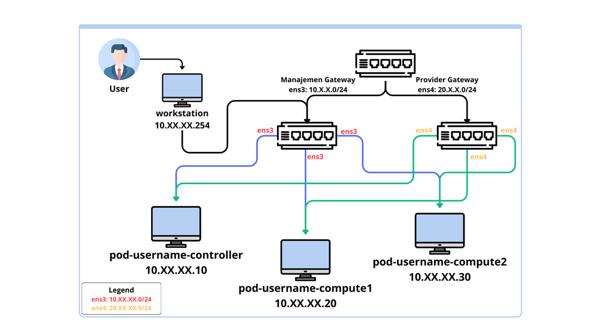

# OpenStack Installation Guide w/ Kolla Ansible

- **Date:** July 1st, 2026

## Table of Contents

<!--toc:start-->

- [Table of Contents](#table-of-contents)
- [Overview](#overview)
- [Topology](#topology)
- [Installation Guide](#installation-guide)
  - [1. Install Python & build deps](#1-install-python-build-deps)
  - [2. Buat & aktifkan virtual environment](#2-buat-aktifkan-virtual-environment)
  - [3. Pastikan `pip` (package manager Python) up-to-date](#3-pastikan-pip-package-manager-python-up-to-date)
  - [4. Install ansible dan kolla-ansible](#4-install-ansible-dan-kolla-ansible)
  - [5. Install deps yang dibutuhkan kolla-ansible](#5-install-deps-yang-dibutuhkan-kolla-ansible)
  - [6. Copy template konfigurasi yang disediakan kolla-ansible](#6-copy-template-konfigurasi-yang-disediakan-kolla-ansible)
  - [7. Konfigurasi inventory files](#7-konfigurasi-inventory-files)
  - [8. Konfigurasi Ansible](#8-konfigurasi-ansible)
  - [9. Tes konektivitas ansible untuk seluruh node](#9-tes-konektivitas-ansible-untuk-seluruh-node)
  - [10. Generate kolla passwords untuk deployment](#10-generate-kolla-passwords-untuk-deployment)
  - [11. Konfigurasi OpenStack Cluster](#11-konfigurasi-openstack-cluster)
  <!--toc:end-->

---

## Overview

Untuk menginstall OpenStack, tidak ada **'single source of truth'**. Banyak metode,
banyak cara, dan _banyak jalan menuju roma_. Maka perlu 'tools' khusus untuk instalasi
OpenStack, biasanya disebut **OpenStack Deployment Tools**. Tools ini ada yang untuk
dev, dev-single instance, dev-multiple instances, ada yang dikhususkan untuk server
baremetal/cloud ataupun yang lainnya.

Praktik kali ini menggunakan [Kolla Ansible](https://opendev.org/openstack/kolla-ansible).
Mekanismenya yaitu OpenStack (services dan infra components-nya) di deploy
sebagai Docker containers. Docker containers yang di deploy juga tidak manual,
tetapi menggunakan [Ansible](https://docs.ansible.com/). Kolla Ansible menawarkan
production-ready Docker containers images untuk OpenStack (services dan infra components),
thanks to Kolla. Sedangkan Ansible sendiri digunakan untuk deploy, mengelola,dan
upgrade OpenStack-nya.

> [!IMPORTANT]
> Meski di deploy di containers, seluruh services (misalnya Nova untuk VM) tetap
> dibuat di atas Host, bukan containers. Sehingga flow-nya:
>
> ```
> [host (vm/baremetal)] --> [OpenStack containers] (NOVA do some API call to libvirt/KVM)
> [host (vm/baremetal)] --> [VM created by OpenStack]
> ```

---

## Topology

Komponen pada praktikum:

> [!NOTE]
> node bisa menggunakan VM/Baremetal. Saat ini menggunakan VM dengan arch x86-64
> dan OS Ubuntu 24.04 LTS

- 1 node controller: Digunakan untuk manage OpenStack services
- 2 node Compute (compute1, compute2): menjalankan VM workload

Setiap node memiliki hostname berikut:

- node controller: `pod-username-controller`
- node compute1: `pod-username-compute1`
- node compute2: `pod-username-compute2`

Detail topologi jaringan:



---

## Installation Guide

### 1. Install Python & build deps

```sh
sudo apt update
sudo apt install git python3-dev libffi-dev gcc libssl-dev python3-venv
```

### 2. Buat & aktifkan virtual environment

```sh
python3 -m venv kolla-venv
source ~/kolla-venv/bin/activate
```

### 3. Pastikan `pip` (package manager Python) up-to-date

```sh
pip install -U pip
```

### 4. Install ansible dan kolla-ansible

```sh
pip install 'ansible-core>=2.16,<2.17.99'
pip install git+https://opendev.org/openstack/kolla-ansible@stable/2025.2
```

> [!NOTE]
> Kolla ansible yang diinstall saat ini yaitu versi stable (saat ini: v2025.2).
> Jika ingin versi berbeda, akses saja [repository kolla-ansible](https://opendev.org/openstack/kolla-ansible)
> kemudian pilih branch yang diinginkan (misal `stable/2026.1`)

### 5. Install deps yang dibutuhkan kolla-ansible

Install deps yang dibutuhkan kolla-ansible kemudian buat direktori konfigurasi
di `/etc/kolla`

Untuk install:

```sh
kolla-ansible install-deps
```

untuk buat direktori konfigurasi & memberi akses ke-user, jalankan:

```sh
sudo mkdir -p /etc/kolla
sudo chown $USER:$USER /etc/kolla
```

### 6. Copy template konfigurasi yang disediakan kolla-ansible

Untuk copy konfigurasi `globals.yml` dan `passwords.yml`:

```sh
cp -r kolla-venv/share/kolla-ansible/etc_examples/kolla/* /etc/kolla
```

Untuk copy inventory files ke direktori saat ini:

> [!NOTE]
> Kolla Ansible memberikan 2 opsi inventory files:
>
> - `all-in-one`: untuk deployment OpenStack dengan single-node
> - `multinode`: untuk deployment OpenStack dengan multi-node atau host yang berbeda

```sh
cp kolla-venv/share/kolla-ansible/ansible/inventory/* .
```

### 7. Konfigurasi inventory files

Karena menggunakan multinode, maka file yang di-edit yaitu `multinode`.
Buat perubahan seperti dibawah ini, JANGAN UBAH part/bagian lain.

```conf
[control]
pod-username-controller

[network]
pod-username-controller

[compute]
pod-username-compute1
pod-username-compute2

[monitoring]
pod-username-controller

[storage]
pod-username-controller
pod-username-compute1
pod-username-compute2

[deployment]
localhost ansible_connection=local
```

### 8. Konfigurasi Ansible

Pertama, buat direktori konfigurasi dulu:

```sh
sudo mkdir -p /etc/ansible
```

Buat dan edit file konfigurasi ansible:

```sh
sudo vim /etc/ansible/ansible.cfg
```

Dalam file `ansible.cfg`, berisi:

```cfg
[defaults]
host_key_checking=False
pipelining=True
forks=100
```

### 9. Tes konektivitas ansible untuk seluruh node

```sh
ansible -i multinode all -m ping
```

> [!IMPORTANT]
> Pastikan proses ini berhasil/sukses. Jika gagal, perbaiki dulu hostname
> setiap node-nya hingga sukses. Pastikan semua node berhasil terhubung

### 10. Generate kolla passwords untuk deployment

> [!NOTE]
> Tahap ini akan membuat/generate password secara otomatis pada file `/etc/kolla/passwords.yml`

```sh
kolla-genpwd
```

Untuk melihat password hasil generate:

```sh
cat /etc/kolla/passwords.yml
```

### 11. Konfigurasi OpenStack Cluster

Edit file `/etc/kolla/globals.yml`

```sh
sudo vim /etc/kolla/globals.yml
```

Buat perubahan seperti dibawah ini

> [!TIP]
> Sesuaikan `openstack_release` dengan yang di-download sebelumnya.
> Sesuaikan juga `network_interface`, `neutron_external_interface`, dan
> `neutron_external_interface` dengan enterface yang host (node controller)
> miliki saat ini (cek dengan `ip a`).Pastikan IP pada `kolla_internal_vip_address`
> berada dalam range `network_interface` yang digunakan (yaitu `ens3`)

```yml
kolla_base_distro: "ubuntu"
openstack_release: "2025.2"
network_interface: "ens3"
neutron_external_interface: "ens4"
kolla_internal_vip_address: "192.168.122.100"
neutron_plugin_agent: "openvswitch"
enable_keystone: "yes"
enable_horizon: "yes"
enable_neutron_provider_networks: "yes"
enable_cinder: "yes"
enable_cinder_backend_lvm: "yes"
cinder_cluster_skip_precheck: "yes"
```

> [!NOTE]
> `neutron_external_interface` digunakan sebagai external network pada
> OpenStack. Digunakan sebagai public network. </br>
> Sedangkan, `network_interface` digunakan sebagai internal network pada OpenStack.</br>
> Konfigurasi `enable_<service_name>` digunakan untuk mengaktifkan setiap service
> yang akan di-install.

### 12. Buat Logical Volumes

Karena pada tahap [sebelumnya](#11-konfigurasi-openstack-cluster) mengaktifkan service
cinder, maka perlu melakukan tahapan untuk membuat logical volumes menggunakan `vgs`.

> [!IMPORTANT]
> Khusus step ini, **jalankan commands dibawah untuk seluruh node**.

1. Buat physical volume (PV).

   > [!NOTE]
   > Sesuaikan `/dev/vdb` dengan yang ada

   ```sh
   sudo pvcreate /dev/vdb
   ```

2. Buat volume groups (VG)

   ```sh
   sudo vgcreate cinder-volumes /dev/vdb
   ```

3. Validasi

   > [!NOTE]
   > Pastikan output menampilkan volume yang telah dibuat sebelumnya.

   ```sh
   sudo vgs
   ```

### 13. Deployment

> [!NOTE]
> Tahapan deployment ini menggunakan mode `multinode`

> [!TIP]
> Pastikan `venv` pada [tahap sebelumnya](#2-buat-aktifkan-virtual-environment) sudah aktif

1. Bootstrap servers dengan deps Kolla Deploy

   ```sh
   kolla-ansible bootstrap-servers -i ./multinode
   ```

2. Pre-Deployment Check untuk host

   ```sh
   kolla-ansible prechecks -i ./multinode
   ```

3. Deploy OpenStack

   ```sh
   kolla-ansible deploy -i ./multinode
   ```

   > [!TIP]
   > Proses akan memakan waktu sekitar ~10 menit.

4. Post-Deployment

   Tahapan ini akan me-generate `admin-openrc.sh`. Berisi ENV dan credentials untuk
   awal login/setup OpenStack.

   ```sh
   kolla-ansible post-deploy -i ./multinode
   ```

### 14. Install OpenStack Client

- Install OpenStack Client versi CLI

  ```
  pip install openstackclient
  ```

- Load ENV dan credentials untuk akses OpenStack yang telah di-install

  ```sh
  source /etc/kolla/admin-openrc.sh
  ```

- Verify OpenStack cluster (via OpenStack CLI)

  ```sh
  openstack service list
  ```

  > [!NOTE]
  > Jika berhasil, akan menampilkan beberapa service yang sudah di-install.
  > Misalnya cinder, heat, nova, dll.

- Verify OpenStack run on Containers (via Docker CLI)

  > [!TIP]
  > Mungkin butuh `sudo` untuk menjalankan docker commands.

  ```sh
  docker ps
  ```

  > [!NOTE]
  > Jika berhasil, maka akan menampilkan containers yang merepresentasikan setiap
  > komponen OpenStack. Misalnya OpenVSwitch, haproxy, cinder, nova-api, nova-scheduler,
  > nova-conductor, etc.
